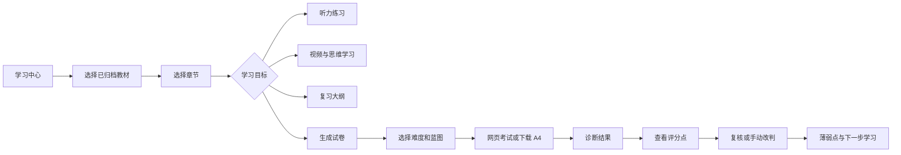

# 教材驱动学习与测评：UX 流程（Gate 3）

状态：已确认

## 1. 背景

用户需要快速从教材进入学习动作，不能先理解系统模块边界。现有顶级入口是看板、学习资料和智慧课堂，学习任务分散。

## 2. 目标

让学生在手机和桌面端都能从“我今天学什么”快速进入对应章节，并把生成、考试、批改和复核组成连续流程。

## 3. 方案

### 3.1 关键流程

### 3.2 快速入口规则

| 位置 | 行为 | 原因 |
| --- | --- | --- |
| 看板首屏 | “继续本章”“听力”“练习”“测试”四个固定操作。 | 学生无需先理解菜单。 |
| 学习中心首屏 | 近期教材和上次章节置顶；未选教材时只显示教材选择。 | 降低错误范围。 |
| 章节页 | 每项学习任务固定图标、学科色和预计时长。 | 青少年快速扫描、少读说明。 |
| 命题配置 | 第一步选范围，第二步选难度，第三步确认蓝图。 | 先解决教材边界，再展示复杂选项。 |
| 考试页 | 题号栏、当前题、保存状态和交卷为固定区域。 | 避免滚动后迷失或误交卷。 |

### 3.3 听力流程

1. 学生选择英语章节和难度。
2. 系统生成或读取同版本原创听力包，显示“AI 原创练习”。
3. 第一次播放时隐藏题目正文，仅显示播放和次数；播放结束展示题目。
4. 默认允许第二次完整播放；提交后显示答案、文本和错句建议。

### 3.4 试卷与复核流程

1. 学生选择单元、期中或期末，系统预选教材范围。
2. 选择基础/标准/挑战难度；风格摘要不可用时明确降级。
3. 确认命题蓝图，生成原创试卷，支持网页考试和 A4 下载。
4. 交卷后客观题立即判定，主观题进入批改中；完成后显示诊断标签而非“正式成绩”。
5. 对低置信度或有异议题，学生/家长查看评分点，填写复核理由或直接选择改判，系统保留变更前后记录。

## 4. 风险

考试界面不应使用游戏化连击、排行或强制倒计时制造焦虑。计时默认关闭，只有用户显式开启“模拟考试”才展示倒计时。

## 5. 回滚

学习中心作为新路由，不替代现有书架和 AI 课堂；入口可关闭，现有 `#resources` 与 `#tutor` 深链保持有效。

## 6. FAQ

### 外部视频是否在页面中播放？

否。页面显示来源、适龄标签和“打开视频”链接，由学生在第三方页面观看。
