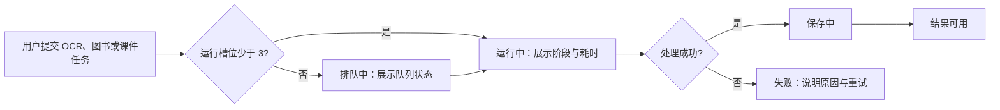

# 性能优化与实时导师用户流程

状态：Gate 3 已确认

## 1. 背景

资源密集任务由上传、排队、处理、保存和页面可用多个阶段组成。现有界面无法统一说明任务是否等待资源、上游模型或已失败，用户容易将正常排队误判为卡死。

## 2. 目标

让用户在不理解后台架构的前提下，知道任务当前阶段、是否已进入队列、何时可重试，以及结果何时真正可用。

## 3. 方案

### 3.1 图书流程

1. 选择文件后展示上传进度与文件大小。
2. 上传完成即展示“元数据解析中”，不可把上传成功当作图书可用。
3. 用户确认元数据后，图书进入统一任务队列；书架卡片展示“排队中”或“处理中”。
4. Markdown、目录和索引完成后，状态变为“可用”；失败时保留原文件和已确认元数据，允许重试处理而不重复上传。

### 3.2 试卷 OCR 流程

1. 选择图片后显示压缩/提交状态。
2. OCR-only 阶段可以作为内部处理阶段显示，但不得显示为任务完成；随后自动执行结构化分析。
3. 仅当结构化结果可保存为错题或试卷时，任务才可进入“可用”；任一阶段失败都提供重试该阶段的入口。

### 3.3 课件流程

1. 发起生成后立即创建核心课件任务，展示排队、`core_model` 或 `core_save` 阶段。
2. 核心课件生成完成后自动保存；只有已保存且可打开时才显示“课件可用”。核心内容为导入、3 个关键知识节和小结，每节正文 120-180 个中文字符。
3. 核心保存成功后自动创建扩展任务，异步补全详细讲解、例子和讲稿。页面保留课件可用状态，并展示“扩展讲解生成中”“扩展已补全”或“扩展补全失败”。
4. 核心保存失败仅重试核心保存；扩展失败仅重试扩展，不应重新生成或隐藏可读的核心课件。

### 3.4 LiveTutor 流程

1. 打开导师后依次展示“连接中”“倾听中”“导师回应中”。
2. 断开时停止麦克风采集与音频播放，提供“重新连接”而非静默失败。
3. 用户或导师中断发言时停止尚未播放的音频并继续保持会话可用。

## 4. 风险

- 进度百分比若无可靠后端数据会误导用户，因此排队和模型处理阶段使用明确状态与已耗时，不伪造完成百分比。
- 任务重试必须复用同一输入与已完成阶段，避免重复上传或重复扣费。

## 5. 回滚

- 新状态展示应接受旧任务状态并降级显示“处理中”。
- 新任务接口不可用时，前端保留现有错误提示与刷新后恢复能力。

## 6. FAQ

### 为什么要显示排队？

第 4 至第 10 个资源密集任务被设计为排队，明确展示可防止用户重复提交同一文件并进一步放大负载。
