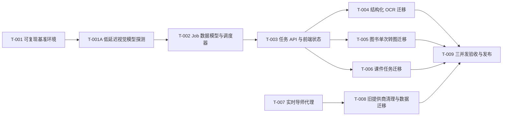

# 性能、实时导师与旧提供商清理任务分解

状态：Gate 5 已确认

## 1. 背景

Gate 1 至 Gate 4 已确认。当前系统的资源密集流程各自后台执行，无法限制跨流程并发，也无法向页面提供可靠的排队、阶段和重试状态；实时导师将供应商密钥暴露给浏览器；旧提供商的依赖、调用和历史类型残留不符合已确认的清理要求。

本任务分解遵循单后端副本、SQLite、最多 10 个接收任务、最多 3 个运行任务的边界。所有任务都必须保持已有图书、错题、课件、测验数据可读取，且不得对生产环境直接写入。

## 2. 目标

按小且可回滚的垂直任务交付：先建立可复现基准，再引入持久化任务契约和调度，随后逐项迁移 OCR、图书和课件，最后迁移实时导师并清理旧提供商。发布前以固定样本、3 并发、5 次运行的最慢值作为性能门禁。

## 3. 方案

### 3.1 里程碑与依赖

### T-001 可复现基准环境

Outcome:

提供一个不依赖开发机 `node_modules`、不触碰生产数据的 Docker Compose 基准环境；在得到 Docker 权限和豆包账户配置后，可只上传已授权的两个固定样本并记录端到端阶段耗时。

Inputs:

- Gate 4 技术设计。
- `tiyu_origin.pdf`、`162157_dadf07c1.jpg` 的授权范围。
- 当前 `package-lock.json`、`backend/package-lock.json`、Poppler 依赖。

Scope:

- 新增或更新 Dockerfile、Compose 配置、隔离环境变量示例、基准运行脚本和基准结果格式。
- 不修改业务 API 语义、生产 Compose、线上数据卷或生产凭据。

Non-goals:

- 不优化业务逻辑。
- 不把任何 API Key 写入版本库、日志或基准结果。

Acceptance:

- `docker compose up` 在可访问 Docker 引擎的机器上启动健康检查。
- 运行脚本记录 upload、queue、parse、model、save、available 和 total 阶段，结果不含题目文本、Base64 或密钥。
- 脚本仅允许白名单文件名；其他本地文件会被拒绝。
- 无网络或缺少凭据时，脚本明确失败而不上传文件。

Freedom:

- 可选择 Shell 或 TypeScript 作为基准脚本语言，使用现有锁文件的依赖版本。
- 可调整容器目录和临时卷命名。
- 不得改变计时口径、样本白名单或将容器环境用于生产部署。

Dependencies:

- Docker Desktop 和当前用户对 Docker 引擎的访问恢复。
- 现有豆包账户配置可用于测试。

Suggested subtasks:

- 固定 Node、Poppler、工作目录和可丢弃数据卷。
- 为 OCR、PDF 和课件建立相同 JSON 基准记录结构。

### T-001A 低延迟视觉模型与输出预算探测

Outcome:

以账户中可用的视觉模型和固定 JPG 样本，选择能在保持可保存结构化题目语义下达到最低延迟的模型/输出预算组合，并为 T-002 的模型槽位和 T-004 的默认配置提供证据。

Inputs:

- T-001 隔离基准环境和基线报告。
- 用户已确认允许切换低延迟视觉模型并压缩非必要 OCR 描述。
- 现有 `ProblemUnit`、`ScannedItem` 与错题/试卷保存实现。

Scope:

- 账户模型列表的只读查询。
- 基准脚本的模型覆盖参数与结果字段。
- 候选视觉模型、最大输出预算和紧凑结构化提示词的隔离测试。
- 仅更新需求、验收、技术设计和任务文档中与该范围变更直接相关的条目。

Non-goals:

- 不修改生产 OCR 路由、保存数据结构或前端行为。
- 不把 OCR 降级为只有纯文本、摘要或不可保存题目。

Acceptance:

- 候选只来自账户返回的可用视觉模型，记录模型、输出预算、总耗时、输入/输出 tokens、JSON 解析与题目数。
- 每个成功结果包含题号、自包含题干、学生答案、标准答案、批注、知识点和状态；固定样本保持 9 道可保存题目。
- 选择可达到或最接近 60 秒的组合；若所有候选仍超时，报告证据并停止，不把未达标组合写入默认配置。

Freedom:

- 可在不改变保存 schema 的前提下重写模型探测 prompt、选择候选顺序和输出 token 上限。
- 不得发送除授权 JPG 外的文件，不得使用模型列表之外的 ID，不得把探测配置直接写入生产 `.env`。

Dependencies:

- T-001。

Suggested subtasks:

- 先测试显式视觉 Lite 模型，再测试较新视觉模型；每个候选只跑一次初筛。
- 对最快且语义完整的候选再运行一次确认，达到 60 秒再进入三并发门禁。

### T-002 Job 数据模型、调度器与阶段指标

Outcome:

后端可持久化接收最多 10 个资源密集任务，以 FIFO 方式最多运行 3 个，并在进程重启后安全恢复或标记任务失败；每个任务具有阶段耗时和受限重试信息。

Inputs:

- Gate 4 的 `jobs` 表、调度与错误处理契约。
- `backend/src/services/databaseService.ts`、`backend/src/routes/analyze.ts`。

Scope:

- `backend/src/services/` 下 Job DAO、调度器、模型槽位和指标模块。
- `backend/src/services/databaseService.ts` 的追加式迁移。
- 任务状态单元/集成测试。

Non-goals:

- 不迁移 OCR、图书或课件的实际执行函数。
- 不引入 Redis、外部队列、第二个后端副本或删除现有表。

Acceptance:

- 原子提交 10 个任务成功，第 11 个明确拒绝。
- 同时提交时最多有 3 个 `running`；刷新、重复请求或调度 tick 不产生双执行。
- 模拟重启后过期租约不会永久卡在 `running`。
- 失败任务仅重试失败阶段，已完成阶段的计时和结果引用保持不变。
- 单元测试覆盖容量、FIFO、幂等、租约恢复、失败重试和权限归属。

Freedom:

- 可采用简单轮询调度或事件触发调度，并可调整内部类/函数结构。
- 任务状态和 API 契约字段不得偏离 Gate 4，SQLite 迁移必须向后兼容。

Dependencies:

- T-001、T-001A 的隔离环境和模型基线；编码本身不依赖云端模型。

Suggested subtasks:

- 建立 `jobs` 表、索引和状态转换约束。
- 以条件更新领取任务，并实现模型槽位计数器。

### T-003 统一任务 API 与前端可恢复状态

Outcome:

用户提交资源密集任务后能看到上传、排队、运行、完成、失败和可重试状态；刷新页面后仍能找回自己的未终态任务。

Inputs:

- T-002 Job 服务。
- Gate 3 的 UX、页面状态和前端契约。

Scope:

- Job REST 路由及权限校验。
- 前端任务查询 client、状态卡片/轮询逻辑。
- `BookUploader`、`CaptureModule`、`CoursewareGenerator` 的状态接入边界。

Non-goals:

- 不在本任务中替换三类任务的业务执行函数。
- 不重做页面视觉风格或修改已完成业务结果的渲染格式。

Acceptance:

- 页面从服务端任务状态渲染队列位置和阶段，2 秒轮询不产生新任务。
- 刷新页面后可恢复任务，完成后跳转或刷新对应结果。
- 失败状态显示不泄露供应商错误详情的可读提示；重试只可用于失败任务。
- 关键路径：提交、排队、完成；异常路径：容量已满、任务失败、页面刷新均手工或自动验证。

Freedom:

- 可复用现有请求工具和 Tailwind 组件。
- 可选择 hook 或局部 state 管理，不得新增全局状态库或改变既有路由。

Dependencies:

- T-002。

Suggested subtasks:

- 建立任务 DTO 和前端状态映射。
- 为三处入口接入统一状态展示，保留旧 URL 的兼容调用。

### T-004 结构化 OCR Job 迁移

Outcome:

试卷从提交到“包含结构化 `problems`、可保存为错题或试卷”的可用状态由统一 Job 驱动，维持现有图文识别质量和一次 JSON 修复重试。

Inputs:

- T-002、T-003。
- `backend/src/routes/analyze.ts`、保存扫描项和错题现有流程。
- 验收项 AC-001、AC-005、AC-006。

Scope:

- OCR 提交/worker 适配、临时图片引用管理、任务结果映射、经 T-001A 验证的模型/输出预算配置。
- OCR 相关前端提交逻辑和回归测试。

Non-goals:

- 不拆成对用户可见的“纯 OCR 后再结构化”两阶段。
- 不改变错题/试卷数据结构或删除 `analyze_tasks` 的兼容读取。

Acceptance:

- 固定 JPG 成功后结果包含可保存 `problems`；保存错题和保存试卷关键路径通过。
- 模拟模型 JSON 无法解析时，只重试 OCR 阶段一次，最终失败可安全重试。
- 三任务并行时实际运行数和模型槽位不突破配置上限。
- T-001 基准记录完整端到端数据；达到 60 秒前不得将性能标为通过。

Freedom:

- 可以提取现有 OCR 函数为 worker handler 和测试 helper。
- 不得改变系统提示词的结构化返回字段或吞掉原始错误诊断。

Dependencies:

- T-002、T-003；云端性能结论依赖 T-001。

Suggested subtasks:

- 将现有 worker 作为 Job handler 接入。
- 保持旧轮询端点映射到 Job 状态，逐步切换前端。

### T-005 图书 Job 迁移与单次转图优化

Outcome:

图书从上传到 Markdown、索引和页面可用由一个可恢复 Job 负责；扫描 PDF 的封面、元数据和页面 OCR 复用同一次转图输出。

Inputs:

- T-002、T-003。
- `backend/src/routes/upload-book.ts`、`backend/src/routes/saveBook.ts`、`backend/src/services/doubaoService.ts`。
- 验收项 AC-002、AC-005、AC-006。

Scope:

- 图书上传/解析/保存状态编排、转图缓存与生命周期、全局文本/视觉模型槽位接入。
- 与图书任务相关的 API 兼容层、前端进度状态和测试。

Non-goals:

- 不改变图书文件格式支持范围、不替换文件存储结构、不删除既有书架数据。
- 不在无基准数据时强行提高模型并发或调整 OCR 页批大小。

Acceptance:

- 同一 PDF 仅执行一次页面渲染；第 1 页同时服务封面和元数据分析。
- 文本版与扫描版均完成原始文件归档、Markdown、目录/元数据索引和 `completed` 终态。
- 失败后重试从失败阶段继续，不重复上传或覆盖已归档原文件。
- 50 页固定 PDF 的无模型转图阶段回归不劣于既有 14.59 秒基线；完整三并发 5 次数据记录后再判定 180 秒门禁。

Freedom:

- 可在隔离临时卷中选择安全的缓存文件命名和清理策略。
- 必须保留路径校验、所有者隔离和已完成图书可读性。

Dependencies:

- T-001、T-002、T-003。

Suggested subtasks:

- 将元数据、转图、OCR/文本转换、保存拆为可计时且可重试的 stage。
- 建立临时文件清理只删除本 Job 产生文件的约束。

### T-006 课件 Job 迁移与输出预算实测

Outcome:

课件生成变为可排队、可恢复、可重试的任务。核心课件完成后立即保存并可打开，扩展讲解异步补全；模型和持久化耗时可单独定位。

Inputs:

- T-002、T-003。
- `backend/src/routes/courseware.ts`、课程页面调用方。
- 验收项 AC-003、AC-005、AC-006。

Scope:

- 核心和扩展课件 Job handler、结果校验/保存适配、前端状态接入、固定输入基准夹具。

Non-goals:

- 不变更课件 JSON schema、错题关联或测验功能。
- 不把扩展讲解失败标为核心课件失败，也不把未保存内容标为可用。
- 核心课件固定为 5 节：导入、3 个关键知识节、小结；每节正文 120-180 个中文字符，无强制长讲稿。
- 扩展任务仅补全详细讲解、例子和讲稿，使用全部 9 道错题作为上下文，不阻塞核心课件打开。

Acceptance:

- 生成核心课件后自动保存；刷新后可打开，且保留现有 `existingSections` 保存兼容路径。
- 核心 Job 只记录 `core_model`、`core_save`；扩展 Job 只记录 `extension_model`、`extension_save`，两者均可受控重试。
- 扩展任务失败时，核心课件仍可读且页面显示扩展失败状态。
- 记录模型首响应、完整响应、JSON 校验、保存和页面可用时间。
- 在 T-001 固定输入三并发 5 次测试中，以核心课件已保存且可打开为终点记录最慢值；若超过 60 秒，输出证据并停止在内容范围决策点。

Freedom:

- 可提取 prompt 构造、JSON 校验和持久化为内部 helper。
- 可在已确认的核心范围内收紧首阶段内容预算；不得丢弃 9 道错题上下文或将未保存内容标为可用。

Dependencies:

- T-001、T-002、T-003。

Suggested subtasks:

- 固定夹具：先解析 `tiyu_origin.pdf` 并取解析目录第一章；书名和学科取解析结果，学生为“性能验收学生”，`ownerId=benchmark`，风格为 `rigorous`，错题上下文为本次 OCR 的 9 道结构化题目。
- 将旧同步接口改为兼容提交/查询层。

### T-007 LiveTutor 豆包实时代理

Outcome:

LiveTutor 使用服务端凭据连接豆包端到端实时语音，保留实时麦克风输入、流式导师音频、双方转写和用户打断；浏览器构建物不包含供应商密钥。

Inputs:

- Gate 4 官方实时语音协议结论。
- `components/LiveTutor.tsx`、`services/audioUtils.ts`、现有认证和后端入口。
- 验收项 AC-008、AC-009、AC-010。

Scope:

- 后端 WebSocket 代理和会话鉴权、实时协议 adapter、前端音频/转写事件映射、会话限流与延迟指标。
- 内网临时 `ownerId` 识别：后端校验 `users` 表存在性，单用户单会话；不作为公网认证方案。

Non-goals:

- 不保存原始音频或转写全文。
- 不加入视频、录音回放、语音克隆或联网检索能力。

Acceptance:

- 用户可实时说话，导师音频和两侧转写流式出现；发言可打断待播音频。
- 浏览器网络与构建产物不含供应商 API Key；后端日志也不输出密钥或音频内容。
- 5 次代表性麦克风轮次记录“判停到首段播放”时延；P95 <= 3 秒才通过。
- 断线、权限拒绝、上游认证/限流均显示可读错误并能安全关闭会话。
- 临时识别风险在技术设计、部署说明和回滚开关中明确记录；公网发布前必须替换为真实认证。

Freedom:

- 可使用合适的 Node WebSocket 库和内部二进制帧格式。
- 必须遵守官方 PCM/Opus、鉴权、关闭握手和并发限制；不得让浏览器直连带密钥的供应商端点。

Dependencies:

- 豆包实时语音额度、服务端网络出口和 T-001 的隔离环境。

Suggested subtasks:

- 定义内部 `session_started`、`audio`、`transcript`、`interrupted`、`error` 事件。
- 在客户端记录 VAD 判停与首次播放的单调时间戳。

### T-008 旧提供商清理与历史兼容迁移

Outcome:

生产代码、依赖、环境、构建产物、UI 和可发布文档不再保留旧提供商残留；历史图书条目仍可显示和读取。

Inputs:

- T-007 已验证的实时导师替代链路。
- 当前依赖清单、旧元数据服务、历史 `extractionMethod` 字段。
- 验收项 AC-007、AC-010。

Scope:

- 前后端依赖和锁文件、旧服务模块、环境模板、类型、UI 标签、可发布文档、数据库迁移和构建扫描脚本。

Non-goals:

- 不删除已有图书、扫描项、课件、测验或用户数据。
- 不修改无关供应商的豆包、TTS 或文件服务配置。

Acceptance:

- 大小写不敏感扫描源代码、锁文件、构建产物、环境模板和可发布文档均无旧提供商 SDK、变量、调用或标签。
- 数据库迁移把历史类型改为 `legacy_ai`，旧书架列表与详情仍可读。
- 前后端构建成功；LiveTutor 回归测试通过且没有客户端密钥。
- 删除路径的代码审查确认没有无关的批量数据删除。

Freedom:

- 可重命名文档与内部服务以移除残留。
- 必须先完成替代链路验收，并为迁移提供备份和回滚步骤。

Dependencies:

- T-007。

Suggested subtasks:

- 执行依赖树、源码、产物、环境和文档五类扫描。
- 为迁移前数据库生成只读备份和验证报告。

### T-009 三并发验收、灰度与生产发布包

Outcome:

形成可审计的发布判定：性能、队列、现有功能、实时导师和残留扫描均通过后，才允许对生产灰度发布。

Inputs:

- T-001 至 T-008。
- Gate 3 验收测试 AC-001 至 AC-010。

Scope:

- 基准结果、自动化回归、发布清单、监控仪表盘、灰度开关、回滚演练记录和上线说明。

Non-goals:

- 不在没有通过所有门禁时发布生产。
- 不修改业务功能以掩盖测试失败。

Acceptance:

- OCR、PDF、课件均完成 3 并发 x 5 次固定输入测试，取最慢值分别满足 60/180/60 秒。
- 10 任务容量、刷新恢复、阶段重试、历史数据读取、实时语音与密钥隔离全部通过对应 AC。
- 仪表盘能按任务/阶段显示 P95、排队、失败、429 和首段语音延迟。
- 灰度开关、上一镜像、数据库备份、回滚步骤和停止条件完成演练。

Freedom:

- 可选择现有日志平台或最小化指标端点实现监控。
- 不得改变验收样本、计时口径、SLO 阈值或用单次结果替代五次门禁。

Dependencies:

- T-001 至 T-008，以及生产变更窗口和部署权限。

Suggested subtasks:

- 输出不含敏感数据的基准报告。
- 按白名单用户灰度，观察后再扩大范围。

## 4. 风险

| 风险 | 控制 |
| --- | --- |
| Docker 当前无权限 | T-001 是后续云端基准的硬前置；未恢复前不得声称 SLO 已验证。 |
| 课件输出过长 | T-006 只测量、不降质；超时后必须重新确认产品范围。 |
| 任务迁移回归 | 每个执行迁移任务必须保留旧 URL 兼容读取并包含关键/异常路径回归。 |
| 旧提供商删除过早 | T-008 依赖 T-007，不允许先删实时导师依赖。 |
| 生产风险 | T-009 前不得生产写入；发布采用灰度开关、可回滚镜像与数据库备份。 |

## 5. 回滚

每个实施任务独立提交、独立验证。T-002 的表结构仅追加；T-004 至 T-006 保留兼容 API；T-007 失败时回退上一个完整镜像而不恢复浏览器密钥；T-008 的数据迁移保留迁移前备份；T-009 失败则关闭灰度开关并停止扩大范围。

## 6. FAQ

### 为什么先做基准环境？

时延目标包含上传、模型和页面可用，缺少可复现环境无法证明优化收益，也无法安全使用外部模型账户。

### 为什么清理旧提供商排在实时导师之后？

实时导师仍是实际依赖。先删除会破坏实时语音输入、流式回复和打断功能，违反已确认的功能保持要求。

### Gate 5 确认是否表示开始编码？

不是。Gate 5 只固定范围、验收和依赖。必须再明确指令“开始实现”或指定一个 `T-xxx`，才进入编码与验证循环。
