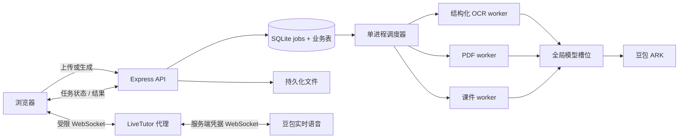

# 性能、实时导师与旧提供商清理技术设计

状态：Gate 4 已确认

## 1. 背景

当前 Express 单进程内直接启动 OCR、PDF 全本转换和课件生成。各流程各自设置并发，彼此不知道对方存在：扫描 PDF 一份任务最多同时发送 3 个视觉批次，文本版 PDF 最多并发 6 个片段，课件不受全局资源控制。多个用户同时操作时，模型请求、内存、CPU 转图和重试会相互叠加。

已确认的静态证据：

| 现象 | 代码位置 | 根因 |
| --- | --- | --- |
| 扫描图书元数据与封面重复转图 | `backend/src/routes/upload-book.ts` | 元数据服务和封面服务各自渲染第 1 页。 |
| 全书 OCR 无全局预算 | `backend/src/services/doubaoService.ts` | 50 页样本拆为 17 个三页批次，任务内并发 3，跨任务无限叠加。 |
| OCR 完成语义正确但不受统一调度 | `backend/src/routes/analyze.ts` | 一次视觉调用会返回结构化题目，但只写入专用任务表。 |
| 课件单请求输出过大 | `backend/src/routes/courseware.ts` | 单章输出 5-8 节、每节 450-750 字，生成和 JSON 解析均阻塞请求。 |
| 实时导师在浏览器保存供应商密钥 | `components/LiveTutor.tsx` | 直接创建旧实时 SDK 客户端，密钥进入前端构建链路。 |

本地无网络基线已完成：`tiyu_origin.pdf` 为 50 页、56,866,009 B；`pdf-parse` 提取耗时 0.77 秒；首次 4 页转 JPEG 耗时 1.82 秒；全部 50 页转 JPEG 耗时 14.59 秒，输出 5.71 MiB。

完整云端基准尚未执行，原因是工作区缺失 `backend/node_modules`，隔离后端启动时无法解析 `express`。Docker 引擎亦不可访问（当前用户无 `docker_engine` 命名管道权限）。没有文件被上传到豆包，未产生 API 费用。

官方实时语音资料已于 2026-07-23 查阅：豆包端到端实时语音 API 为双向 WebSocket；支持 16 kHz 单声道 PCM int16 或 Opus 输入、流式返回转写与音频；可要求 24 kHz `pcm_s16le` 输出；支持服务端打断与可配置判停窗口。参考：[官方 API 接入文档](https://www.volcengine.com/docs/6561/1594356)。

## 2. 目标

在最多 3 个资源密集任务运行时，固定样本和固定课件输入的端到端 P95 达到：结构化 OCR <= 60 秒、课件可打开 <= 60 秒、`tiyu_origin.pdf` 图书可用 <= 180 秒。系统最多接收 10 个资源密集任务，超出运行槽位时展示可恢复的排队状态。

旧提供商的 SDK、密钥、调用、类型值、UI 标签、构建产物和非审计文档均被清理。实时导师继续具备麦克风实时输入、流式语音输出、双向转写和打断能力，首段语音播放 P95 <= 3 秒，且供应商密钥不进入浏览器。

## 3. 方案

### 3.1 边界与架构

本版本保持单后端副本和 SQLite，不引入 Redis、消息队列或新数据库。理由：当前部署、数据访问和任务表都在 SQLite 中；10 个接收任务和 3 个运行槽位可用短事务原子领取，新增基础设施不能直接改善模型延迟。风险：此设计不支持多后端副本抢占同一队列；横向扩容前必须升级为具备分布式锁的队列。

### 3.2 持久化任务模型与调度

新增 `jobs` 表，替代各模块各自 fire-and-forget 的不可观测后台执行方式；既有 `analyze_tasks` 保留到迁移完成，读取接口保持兼容。

| 字段 | 含义 |
| --- | --- |
| `id`, `type`, `ownerId`, `requestKey` | UUID、`ocr`/`book`/`courseware`、归属和幂等键。`ownerId + requestKey` 唯一。 |
| `status`, `stage`, `queuePosition` | `queued`/`running`/`completed`/`failed`/`cancelled`，以及可见阶段与当前队列位置。 |
| `payloadRef`, `resultRef`, `errorCode` | 文件或数据库引用、结果引用、可读且可分类的错误。禁止将 Base64 图像复制进任务表。 |
| `attempt`, `notBefore`, `leaseUntil` | 失败阶段重试、退避时间和进程异常后的租约恢复。 |
| `createdAt`, `startedAt`, `completedAt`, `stageTimingsJson` | 端到端和各阶段的单调计时证据。 |

调度规则：

1. 提交时同一 SQLite 事务检查 `queued + running < 10`，写入任务和初始阶段；满额返回明确的容量错误，不接受“黑洞任务”。
2. 调度器以 FIFO 领取最多 3 个 `queued` 任务；每次领取使用条件更新，避免刷新或双请求重复运行。
3. 任务内部的模型调用必须申请全局槽位，不得保留当前按流程独立的 3/6 并发。视觉、文本和课件槽位初始值由基准配置，并记录实际使用量。这样 3 个 PDF 不能把上游并发放大为 9 个视觉请求。
4. 重试仅从失败阶段开始；模型 429、网络超时采用有限次指数退避，转图、保存或 JSON 无法修复时直接失败并保留诊断 ID。
5. 启动恢复：过期 `running` 租约回到 `queued`；不可重试的本地文件缺失标为 `failed`。刷新页面只查询 `jobs/:id`，不创建新任务。

### 3.3 API 与页面契约

新接口为内部统一契约；旧 URL 在迁移期转为提交任务或查询适配层，避免破坏当前前端。

| 接口 | 行为 |
| --- | --- |
| `POST /api/jobs/ocr` | 保存图片引用，提交结构化 OCR 任务，返回 `jobId` 和排队状态。结果仍必须包含 `problems`，可直接保存为错题或试卷。 |
| `POST /api/jobs/books` | 完成上传并提交图书任务；返回 `jobId`，不再要求前端先等元数据再触发第二个后台流程。 |
| `POST /api/jobs/courseware` | 以已确认的章节和学习上下文提交课件任务。 |
| `GET /api/jobs/:id` | 返回状态、阶段、排队位置、阶段耗时、可显示错误和结果引用；仅允许所属用户或共享范围读取。 |
| `POST /api/jobs/:id/retry` | 仅允许失败任务的归属用户发起，复用输入和已完成阶段。 |
| `GET /api/jobs?ownerId=...` | 支持页面恢复未终态任务；不返回其他用户的 payload。 |

前端以 2 秒轮询任务状态；状态变更只改变局部卡片，结果完成后再刷新目标列表。上传阶段仍在浏览器中计时，后端响应附带服务端阶段时间，页面记录 `click -> available` 作为验收真值。

### 3.4 PDF、OCR 与课件路径

**PDF：** 上传流写盘后单次读取；`pdf-parse` 先分类文本/扫描版。扫描版在一次 `pdftoppm` 执行中产出第 1 页封面和 OCR 页图，元数据分析复用第 1 页，消除重复渲染。按页批次调用视觉模型，批大小、图像质量和全局模型槽位全部配置化并通过固定样本筛选，不在未经实测前假定更高并发必然更快。文本版复用已提取文本并按全局文本槽位转换 Markdown。保存完成、索引更新和页面可读性是图书终态，元数据返回不是完成。

**OCR：** 选择账户中经固定样本验证的低延迟视觉模型，并设置最大输出预算。保留单次请求生成 `content_markdown + problems` 的用户完成语义；允许压缩页眉、重复版面描述和非必要全文，但每个 `problems[]` 项必须保留题号、自包含题干、学生答案、标准答案、批注、知识点和状态，仍可直接保存为错题或试卷。不得把“先纯 OCR、稍后再结构化”暴露成用户完成态。若返回 JSON 不合法，进行一次同任务重试；二次失败保留受限调试文件和错误码，允许用户只重试该阶段。

**课件：** 基准输入先解析 `tiyu_origin.pdf`，取解析目录第一章；书名和学科取该解析结果，学生固定为“性能验收学生”，`ownerId=benchmark`，`teachingStyle=rigorous`，错题上下文为本次 OCR 的 9 道结构化题目。任务执行时记录模型首 token、完整响应、JSON 校验和持久化耗时。当前生成内容规模是达到 60 秒的最大不确定性：在云端 5 次三并发基准后，若仍超时，唯一有效的优化手段是收紧每页内容/讲稿预算或改为可打开的流式分段课件。前者会改变内容密度，后者会改变“完整课件可用”的业务定义，二者均不得在本次实现中擅自采用。

### 3.5 实时导师与密钥隔离

选择豆包端到端实时语音 O2.0 路线，原因是低延迟语音到语音、可配系统人设、流式交互与标准音色均满足导师场景；不采用把独立 ASR、文本模型和 TTS 串联的三段式路径，以减少首段语音时延和打断协调复杂度。

1. 浏览器仅采集 16 kHz 单声道 PCM int16（或经验证后 Opus），通过受认证的 `/api/live-tutor` WebSocket 发给本服务；绝不接收或持有供应商密钥。
2. 后端为每个已认证会话创建一个到豆包的 WebSocket，上行原样转发音频，下行把音频、用户转写、导师转写、打断事件映射为稳定的内部事件。
3. 前端收到第一段音频即排入 `AudioContext`，收到打断事件立即停止未播放音频并清空队列；首包时间从本地 VAD 判停事件到首次 `AudioBufferSourceNode.start()` 记录。
4. `end_smooth_window_ms` 初始以 600-800 ms 做基准候选，目标是在不截断短暂停顿的前提下降低 P95；最终值由 5 轮真实麦克风测试决定。会话、原始音频和转写默认不落盘；只记录匿名化延迟、错误码和用量指标。
5. 配置采用服务端 `DOUBAO_REALTIME_*` 名称，最小权限、轮换和日志脱敏；连接数、每用户会话数、单会话时长与发送速率均设上限，防止成本失控。

### 3.6 旧提供商移除与兼容

替换图书元数据服务为现有豆包适配器，移除前后端旧 SDK、客户端初始化、构建环境注入、环境变量读取、依赖项、服务文件和 UI 文字。历史记录中的旧 `extractionMethod` 在一次数据库迁移中规范为 `legacy_ai`，列表读取保持显示；不删除图书、OCR、课件或测验数据。

发布门禁使用大小写不敏感仓库扫描、锁文件扫描、构建产物扫描和运行时环境白名单扫描。历史审计报告若需保留旧名称，放在不随生产仓库和构建产物发布的受控归档中；否则字面残留会使“文档无残留”的验收无法成立。

### 3.7 可观测性、配置与部署

| 项目 | 内容 |
| --- | --- |
| 指标 | `job_e2e_ms`、`job_queue_ms`、`job_stage_ms`、`model_request_ms`、`job_terminal_total`、`live_first_audio_ms`、模型错误/429 计数。所有指标带 `type`、`stage`、`model`，不带题目文本或音频。 |
| 日志 | 使用 `jobId`、`ownerId`（哈希）、`stage`、`attempt` 关联；日志不记录 API Key、Base64、转写全文或试题内容。 |
| 配置 | `RESOURCE_TASK_CAPACITY=10`、`RESOURCE_WORKERS=3`、各模型槽位、重试次数、超时、PDF 批次和图像质量均从环境读取，配置变更记录到作业。 |
| 灰度 | `JOB_SCHEDULER_ENABLED`、`PDF_SINGLE_RENDER_ENABLED`、`LIVE_TUTOR_DOUBAO_ENABLED` 独立开关；按用户白名单灰度。 |
| 部署 | 先部署数据库迁移和兼容读取，再启用调度，最后切换实时导师。单副本期间禁止把后端扩为多副本。 |

本地验收环境必须采用 Docker Compose，包含应用、可丢弃 SQLite 数据卷、固定 Poppler 版本和可注入的豆包凭据；不安装或依赖宿主机服务。当前 Docker 权限不可用，因此需要恢复 Docker Desktop/用户管道访问后，才可执行获授权的端到端云端样本测试。

## 4. 风险

| 风险 | 结论与控制 |
| --- | --- |
| 180 秒 PDF 目标 | 50 页转图仅占约 15 秒；主风险是 17 个视觉批次、上游延迟与限流。必须以授权账户真实基准验证批大小和模型槽位，未验证前不能宣称达标。 |
| 60 秒课件目标 | 当前输出长度可能使单次模型完成超出预算。若真实基准失败，需要用户确认“缩短内容”或“结果可逐段打开”之一。 |
| 三并发定义 | 任务数限制不等于模型 QPS 限制；本设计的双层槽位避免上游请求倍增，但过低槽位可能拉长 PDF，总值必须通过压测确定。 |
| SQLite | 适用于单副本、小容量队列；多副本或更高吞吐需要迁移到外部队列，当前不做。 |
| 实时语音成本与可用性 | 受账户配额、QPM/TPM、地区网络和 WebSocket 稳定性影响；建立并发、时长、断线和用量告警。 |
| 历史兼容 | 移除旧类型值须先迁移数据库；否则旧书架条目可能显示异常。先备份并在副本数据验证。 |

## 5. 回滚

1. 每次发布保留上一个可运行镜像及数据库备份；数据库新增字段只追加，不删除旧表和旧业务数据。
2. `JOB_SCHEDULER_ENABLED=false` 时新提交回退到兼容 API，已领取任务继续运行或标记为可重试，避免双执行。
3. `PDF_SINGLE_RENDER_ENABLED=false` 时只恢复旧转图逻辑；不得回滚图书文件或已完成 Markdown。
4. 实时导师切换失败时回退到上一个已部署镜像，而不是向浏览器恢复供应商密钥；新版本始终不允许客户端直连带密钥的实时模型。
5. 旧提供商清理在替代链路验收、构建扫描和灰度通过后才删除上一版本镜像的保留期；回滚版本仅作为受控应急镜像，不与新版本混合运行。

## 6. FAQ

### 为什么不直接把并发调高？

现有每个 PDF 已会并发调用模型。提高每条路径的数值会让三并发任务产生更多上游请求，触发 429 和退避，端到端反而更慢。必须同时控制任务和模型请求。

### 为什么本轮没有发送已授权的测试文件？

运行当前后端的依赖目录缺失，Docker 又不可访问。继续发送文件将无法获得端到端结果，也不符合“只为性能测试”的授权目的；恢复可复现环境后才执行。

### 为什么不直接把课件改短？

缩短内容会改变现有课件的信息密度。目标是 60 秒，但用户尚未确认内容标准可以降低；真实基准失败后，需要在“内容预算”和“逐段可用”之间做明确产品决策。
