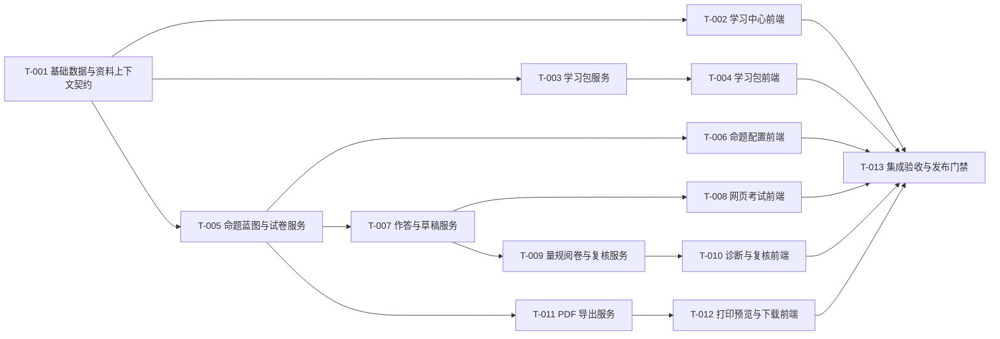

# 教材驱动学习与测评：实施任务分解（Gate 5/6）

状态：已完成（T-001 至 T-013 已完成；发布证据见 [发布证据与回滚包](2026-07-24-textbook-learning-release-evidence.md)）

## 1. 背景

本文件把已确认的教材学习、原创测评、过程性阅卷和 A4 导出需求，拆为可独立实现、演示、回滚和验收的任务。任务严格约束业务结果、数据/API 契约、影响边界和验收条件；内部模块划分、算法组织和局部组件实现由实施者在既有技术栈内决定。

现有能力必须保持：教材书架、拍题、错题、章节课件、旧章节测验、`#dashboard`、`#resources/*`、`#tutor/*` 和历史 `quiz_results` 均不可被本计划破坏。

## 2. 目标

按依赖顺序交付从“教材章节”到“学习包、原创试卷、诊断复核和 PDF”的完整能力，同时保证：

- 内容范围、资源、试卷和作答始终记录并按前端当前选择的 `ownerId` 筛选；首期为单设备本地资料模式，不构成服务端安全隔离。
- 新正式试卷与旧 `classroom_items`/`quiz_results` 使用独立模型，历史数据仍可读。
- AI 只生成原创内容；风格样本、外链和自动评分均可审计。
- 每项任务完成后都有明确行为证据，而不是仅有代码变更。

## 3. 方案

### 3.1 执行规则

- 每个任务开始前，实施者必须阅读其 `Inputs`，并对将编辑的函数、类或方法运行 GitNexus `impact(..., direction: upstream)`。HIGH/CRITICAL 影响必须先报告并获得继续确认。
- 每项任务只在其 `Scope` 内改动。发现需要改变上游需求、API 契约、资料上下文边界或视觉契约时，停止实现并回到对应文档更新。
- 每项任务至少验证一个关键路径和一个异常路径；涉及 UI 的任务必须在 1440px、768px、390px 视口完成截图和键盘检查。
- 每项任务提交前运行 `detect_changes()`，确认没有涉及无关执行流；不得清理工作树中已有的无关改动。

### 3.2 依赖图

### T-001 基础数据、资料上下文与能力开关

**Outcome**

系统具备新学习能力所需的追加式数据结构、统一 `ownerId` 资料归属字段和可独立关闭的能力开关；前端可据此切换本地资料上下文，新增记录不改变历史课堂测验、错题或图书的读取语义。

**Inputs**

- [业务需求](../requirements/2026-07-24-textbook-learning-requirements.md)：BR-001、BR-007、BR-011。
- [技术方案](2026-07-24-textbook-learning-technical-design.md)：3.2 数据模型、3.3 运行边界、3.7 现有功能保护。
- [验收](2026-07-24-textbook-learning-acceptance.md)：AC-002、AC-003、AC-016。

**Scope**

- `backend/src/services/databaseService.ts` 的追加式迁移。
- 新学习域的数据访问模块与共享 DTO/校验模块，位于 `backend/src/services/`、`backend/src/types.ts` 或等价的新模块；`external_resources` 追加标题、时长、适龄标签、健康状态和最近检查时间字段。
- 学习域路由的 `ownerId` 格式校验与资料上下文查询辅助模块，不引入认证或授权中间件。
- 环境配置示例、能力开关读取和后端单元/集成测试。

**Non-goals**

- 不创建面向学生的页面、学习包、试卷、PDF 或评分结果。
- 不改写或迁移历史 `classroom_items`、`quiz_results` 的内容。
- 不引入 Redis、外部数据库、全局认证重构或平台教材库。

**Acceptance**

- 空数据库和含历史学习记录的升级数据库均可重复启动；迁移只新增表、索引或向后兼容字段。
- 历史 `external_resources` 可无损升级；缺少审核时间或健康状态不是 `healthy` 的记录不得被新学习包返回。
- 所有新增学习域记录都保存非空 `ownerId`；以 A/B 两个本地资料上下文读取时，只返回请求上下文对应的记录。该检查只验证筛选行为，不得被表述为服务端越权防护。
- 单独关闭任一能力开关时，对应新路由拒绝新操作但不影响旧章节测验、TTS、课件和错题。
- 提供 AC-003 所需的 A/B 资料上下文测试数据，并保留 AC-016 的历史记录读取回归证据。

**Freedom**

- 可选择 DAO、repository 或直接 SQL 的内部组织方式，可调整新增表的索引和内部枚举。
- 不得改变已确认实体、`ownerId` 本地资料上下文、追加式迁移和能力开关语义；不得把客户端传入的 `ownerId` 声称为认证或授权凭据。

**Dependencies**

- 无；是所有新增持久化能力的前置任务。

### T-002 学习中心路由与教材锚点前端

**Outcome**

学生可以进入 `#learn`，选择家庭共享或自己已归档且元数据完整的教材与章节，并在三次点击内看到听力、视频、练习、测试四个行动入口；元数据缺失时被清晰阻止。

**Inputs**

- [PRD](2026-07-24-textbook-learning-prd.md)：US-001、页面与功能清单。
- [UX 流程](../design/2026-07-24-textbook-learning-ux-flow.md)：3.1、3.2。
- [页面状态](../design/2026-07-24-textbook-learning-page-states.md)：学习中心状态。
- [前端契约](../design/2026-07-24-textbook-learning-frontend-design.md)：`#learn`、`BookChapterPicker`、`LearningActionGrid`。
- AC-001、AC-002、AC-016。

**Scope**

- `App.tsx` 的 Hash 路由解析与 `Layout.tsx` 的新入口接入。
- 新 `LearningHub`、教材/章节选择、行动入口和本地展示状态组件。
- 前端书籍读取服务与类型映射，仅为教材锚点校验所需字段补充数据。
- 该页面的响应式、焦点、空/加载/资料上下文切换/校验失败状态和浏览器测试。

**Non-goals**

- 不生成听力、视频、试卷或复习大纲。
- 不修改 `AIClassroom` 的内部视图模型，不替换旧导航或删除旧深链。
- 不创建新的全局状态库或引入 React Router。

**Acceptance**

- 已补全的家庭共享教材对大宝、二宝均可选择且只展示其自身章节；缺学科、年级或目录的教材不能进入生成动作，并显示缺失字段。
- 移动端四行动磁贴保持可点击，长教材/章节标题换行且不遮挡；桌面、平板、手机截图和键盘焦点检查通过。
- 现有 `#dashboard`、`#resources/*`、`#tutor/*` 的访问与返回行为保持不变。
- 通过 AC-001、AC-002、AC-016 的前端部分。

**Freedom**

- 可在现有 Tailwind、Lucide、组件库和局部 Hooks 中决定页面组织、缓存和交互细节。
- 不得改变路由契约、四个行动名称、教材锚点校验要求或 UI/UE 文档中的可访问性要求。

**Dependencies**

- T-001。

### T-003 学习包服务：原创听力、审核外链与复习内容

**Outcome**

后端可以基于教材锚点创建并读取学习包：英语章节得到带评分点的 AI 原创听力内容；数学/科学章节得到已审核的第三方视频元数据；所有结果可追溯、与资料上下文关联、可降级。

**Inputs**

- BR-001 至 BR-004、BR-011。
- [技术方案](2026-07-24-textbook-learning-technical-design.md)：`learning_packages`、`external_resources`、`POST/GET /api/learning-packages`。
- [页面状态](../design/2026-07-24-textbook-learning-page-states.md)：学习包状态。
- AC-004 至 AC-007。

**Scope**

- 学习包服务、路由、输入校验、资料上下文关联、持久化和相关后端测试。
- 对现有 TTS API 的受控复用，仅限生成原创听力音频，不改变其既有对外行为。
- 外链资源的审核状态、链接健康状态与返回过滤。

**Non-goals**

- 不抓取、下载、代理播放或存储第三方视频。
- 不把教材原文、真题全文或学生身份发送到第三方网站。
- 不实现听写、跟读、个性化学习路径或面向管理员的审核 UI。

**Acceptance**

- 英语学习包含原创标识、脚本、题目、答案、评分点和可播放音频引用；英语视频按同一审核外链契约返回；无英语章节正文时拒绝生成听力。
- `reviewedAt` 为空或 `linkHealthStatus` 不为 `healthy` 的外链不进入学习包结果；审核通过且健康有效的资源返回标题、来源、时长、适龄标签和 URL，不返回任何学生信息。
- 标注年级的奥数资料可用于对应年级的数学思维资源；资料年级缺失时返回字段级校验错误。
- 通过 AC-004、AC-006、AC-007 的 API/服务部分。

**Freedom**

- 可决定提示词组装、内容缓存、任务同步/异步边界和链接健康检查的内部实现。
- 不得绕过教材范围、原创标识、审核过滤、`ownerId` 资料归属和既有 TTS API 兼容性；不得把资料归属实现为认证承诺。

**Dependencies**

- T-001。

### T-004 学习包消费前端：听力、视频和复习内容

**Outcome**

学生可以从学习中心打开学习包，完成两次播放限制的听力练习、访问合格视频链接并阅读复习内容；外链缺失或生成失败时页面可理解且可重试。

**Inputs**

- T-003 API 契约与可用测试数据。
- [UX 流程](../design/2026-07-24-textbook-learning-ux-flow.md)：3.3 听力流程。
- [UI/UE 设计](../design/2026-07-24-textbook-learning-ui-ux-design-system.md)：音频控制、行动磁贴与可访问性规则。
- AC-004、AC-005、AC-006。

**Scope**

- `#learn/package/:id`、`LearningPackage` 以及音频、外链、复习内容展示组件。
- 学习包 API 客户端、`learning_package_progress` 的服务端播放/提交状态呈现、失败/空/加载/重试状态。
- 新窗口外链打开的安全属性、移动端与键盘测试。

**Non-goals**

- 不在浏览器搜索视频、不嵌入第三方播放器、不下载音频/视频。
- 不在前端生成题目、评分点或 TTS 音频。
- 不实现试卷配置、作答持久化或成绩诊断。

**Acceptance**

- 首次完整播放时题目正文隐藏；播放结束才显示题目；第二次后不能再次完整播放，提交后可查看文本和解析。
- 视频卡片只在后端返回审核通过资源时显示，点击以安全新窗口打开；无合格资源显示空状态而非失效链接。
- 页面在 390px、768px、1440px 无溢出，音频控制、外链和返回操作可键盘执行。
- 通过 AC-004、AC-005、AC-006 的浏览器部分。

**Freedom**

- 可决定播放器状态机、局部缓存、卡片排布和内容折叠方式。
- 不得改变播放次数规则、题干显示时机、外链边界、视觉令牌和无障碍契约。

**Dependencies**

- T-002、T-003。

### T-005 命题蓝图与结构化原创试卷服务

**Outcome**

后端可以将教材范围、试卷类型、难度和可用风格摘要转为可审查的命题蓝图，再生成版本化、不可变的结构化原创试卷；旧章节测验仍按原接口工作。

**Inputs**

- BR-005 至 BR-008、BR-011。
- [PRD](2026-07-24-textbook-learning-prd.md)：US-002、US-003、US-006、US-008。
- [技术方案](2026-07-24-textbook-learning-technical-design.md)：`assessment_blueprints`、`assessment_papers`、相关 API。
- AC-008、AC-009、AC-016。

**Scope**

- 蓝图与试卷领域的新增表迁移、服务、路由、输入/输出 DTO、资料上下文关联和后端测试。
- 风格摘要的审核状态读取与生成降级逻辑。
- 与现有 `assessment.ts` 并行的新 API，不修改旧 `/api/generate-assessment` 契约。

**Non-goals**

- 不实现网页考试、草稿、PDF、主观题批改或管理端录入界面。
- 不保存、输出或反向拼接广州/奥数样本原题全文。
- 不在风格摘要不可用时阻止教材基础原创卷生成。

**Acceptance**

- 生成前蓝图包含教材范围、章节、试卷类型、难度、题型、题数、分值、总分和生成版本；默认难度为标准/现有 2 星。
- 每份生成试卷可读出其蓝图和 `ownerId`，同一已生成版本不能被后续生成覆盖。
- 未审核风格摘要时生成教材原创卷且无对应风格标签；已审核摘要也不得使输出包含样本原题全文。
- 旧 `/api/generate-assessment`、历史 `classroom_items` 和 `quiz_results` 回归通过。
- 通过 AC-008、AC-009、AC-016 的后端部分。

**Freedom**

- 可调整出题提示词、试卷 JSON 内部字段、版本 ID 和服务分层；可决定同步或任务化生成。
- 不得改变蓝图的审查字段、原创/风格约束、默认难度、不可变版本和旧接口兼容边界。

**Dependencies**

- T-001。

### T-006 命题配置前端与蓝图确认

**Outcome**

学生或家长可以在网页中选定单元/期中/期末范围和难度，确认题型、题数、分值和风格可用性后生成一份新原创试卷。

**Inputs**

- T-005 API 契约与试卷样例。
- [UX 流程](../design/2026-07-24-textbook-learning-ux-flow.md)：3.4 试卷与复核流程。
- [前端契约](../design/2026-07-24-textbook-learning-frontend-design.md)：`#learn/assessment/new`、`AssessmentBlueprintForm`。
- AC-002、AC-008、AC-009。

**Scope**

- `AssessmentComposer`、范围/难度/风格状态、蓝图预览和生成确认界面。
- 相应 API 客户端、校验错误、生成中/失败/重试与路由跳转。
- 分段难度控件、桌面/移动布局和键盘可访问性。

**Non-goals**

- 不实现试卷作答、批改、PDF 预览或风格摘要审核管理。
- 不允许前端直接伪造蓝图或拼接外部题源。
- 不改动现有 `QuizGenerator` 的行为。

**Acceptance**

- 范围、试卷类型、难度未完整时不能生成，错误明确定位至字段；默认选中标准难度。
- 难度变化会更新蓝图预览而不立即创建试卷；确认后跳转到新试卷路由。
- 风格摘要不可用时界面明确说明“教材原创试卷”，不显示广州/希望杯风格标签。
- 通过 AC-002、AC-008、AC-009 的浏览器部分和 3 个目标视口检查。

**Freedom**

- 可决定分步表单、摘要布局、预览刷新时机和局部状态实现。
- 不得跳过蓝图确认、改变字段默认值或用营销/装饰性 UI 弱化考试信息密度。

**Dependencies**

- T-002、T-005。

### T-007 网页作答、草稿与提交服务

**Outcome**

后端可为结构化试卷创建一个唯一作答记录、保存草稿、恢复状态并幂等提交；刷新或网络抖动不会产生重复作答或丢失已保存答案。

**Inputs**

- T-005 结构化试卷 API。
- [技术方案](2026-07-24-textbook-learning-technical-design.md)：`paper_attempts`、`POST/PATCH /api/paper-attempts`。
- [页面状态](../design/2026-07-24-textbook-learning-page-states.md)：网页考试状态。
- AC-010、AC-016。

**Scope**

- 作答、草稿、提交状态相关的新表、服务、路由、资料上下文关联和集成测试。
- 幂等键或等价机制、提交后的状态转换和安全重试。
- 仅供新结构化试卷使用的 API 客户端契约文档更新。

**Non-goals**

- 不实现阅卷算法、复核、PDF 导出或浏览器 UI。
- 不改变旧 `QuizExam` 对 `quiz_results` 的创建和提交流程。
- 不在浏览器端持久化跨用户可读的完整答案副本。

**Acceptance**

- 同一 `ownerId + paperId` 的并发创建/重复提交不产生两条有效进行中作答。
- 草稿保存后刷新可恢复；不存在的试卷、已提交后二次提交和无效题号均返回可识别错误。
- 提交后的作答进入明确的批改前状态，已有答案不可被静默覆盖。
- 通过 AC-010、AC-016 的 API/服务部分。

**Freedom**

- 可选择草稿 JSON 的内部形态、幂等实现和服务模块名称。
- 不得改变 `paperAttemptId` 恢复语义、资料归属、提交不可重复和旧测验兼容性；不得将 `ownerId` 作为服务端授权条件宣传。

**Dependencies**

- T-001、T-005。

### T-008 网页考试前端

**Outcome**

学生可以在试卷式页面阅读、作答、保存草稿并确认交卷；选择、填空和解答题具有稳定答题区，移动端可连续完成考试。

**Inputs**

- T-007 API 契约。
- [前端契约](../design/2026-07-24-textbook-learning-frontend-design.md)：`#learn/paper/:id`、`PaperRenderer`、`AttemptAnswerForm`。
- [UI/UE 设计](../design/2026-07-24-textbook-learning-ui-ux-design-system.md)：考试纸面、题号栏、表单与移动端规则。
- AC-010、AC-016。

**Scope**

- `PaperExam`、`PaperRenderer` 的网页模式、答题表单、题号导航、保存状态和交卷确认。
- 作答 API 客户端、草稿恢复和有限重试。
- 考试页的无障碍、响应式和浏览器测试。

**Non-goals**

- 不负责出题、评分、PDF 生成或结果诊断。
- 不将浏览器截图作为试卷导出方案。
- 不添加强制倒计时、排行或游戏化干扰；模拟考试计时只在显式开启后显示。

**Acceptance**

- 三类题型可完成作答，长题干与数学公式不遮挡答题区；刷新后恢复草稿，保存失败时显示可重试状态。
- 交卷前有确认，交卷后不允许静默修改已提交答案；重复点击不会创建第二份作答。
- 在 390px 下题号栏可访问、答题区不小于 160px；键盘焦点与 `aria-live` 状态提示符合前端契约。
- 通过 AC-010、AC-016 的浏览器部分。

**Freedom**

- 可决定题号导航、草稿提示、输入组件封装和局部渲染优化。
- 不得改变试卷数据语义、作答 API 状态、考试纸面可读性或 UI/UE 约定。

**Dependencies**

- T-006、T-007。

### T-009 评分量规、过程性阅卷与复核服务

**Outcome**

系统按评分点而非二元对错给正式试卷诊断分：客观题支持等价规范化，解答题能对过程、结果、表达分别给分并保存证据、置信度和可审计复核事件。

**Inputs**

- BR-009、BR-010、BR-011。
- [技术方案](2026-07-24-textbook-learning-technical-design.md)：3.5 量规阅卷算法、`attempt_item_results`、`review_events`。
- [验收](2026-07-24-textbook-learning-acceptance.md)：AC-011 至 AC-014。
- T-005 试卷量规字段、T-007 作答提交状态。

**Scope**

- 题目量规校验、答案规范化、阅卷服务、结果持久化、复核/改判路由和后端测试夹具。
- 模型结构化结果校验、分数边界校验、低置信度状态和审计事件写入。
- 新试卷诊断分重算逻辑。

**Non-goals**

- 不修改旧 `classroom.ts` 的章节测验阅卷逻辑或重算历史 `quiz_results`。
- 不将自动分数标为正式学校成绩，不实现班级排行或自动通过/不通过判定。
- 不在无量规、无学生证据或模型结构非法时伪造确定性评分。

**Acceptance**

- 等价全半角、大小写、数学符号和备选答案可正确判分；仅字符串包含的非等价答案不能误判满分。
- “过程正确、结果错误”得到过程分并失去结果分；“表述不同、满足量规”不因措辞扣分；每项都保存学生证据和理由。
- `confidence < 0.75` 或结果无证据时标为建议复核，且不计入已掌握。
- 复核/改判保留原结果、改判结果、原因、操作者类型和时间，重新计算诊断分但不覆盖原判。
- 通过 AC-011、AC-012、AC-013、AC-014。

**Freedom**

- 可采用规则优先、模型辅助或其他满足量规的内部策略，可设计提示词、评分辅助函数和结果缓存。
- 不得改变评分量规的四个评估维度、0.75 阈值、证据要求、审计不可覆盖和“仅学习诊断”边界。

**Dependencies**

- T-005、T-007。

### T-010 诊断结果与逐题复核前端

**Outcome**

学生和家长可以查看诊断性质的总览、每题评分点、过程证据、低置信度提示，并对单题提交复核或执行带确认的手动改判。

**Inputs**

- T-009 诊断与复核 API。
- [前端契约](../design/2026-07-24-textbook-learning-frontend-design.md)：`#learn/attempt/:id`、`RubricBreakdown`、`ReviewDrawer`。
- [UI/UE 设计](../design/2026-07-24-textbook-learning-ui-ux-design-system.md)：评分点表、复核抽屉、状态颜色与无障碍。
- AC-012 至 AC-014。

**Scope**

- `AttemptDiagnosis`、评分点明细、复核抽屉、手动改判确认、审计记录显示和 API 客户端。
- 批改中、低置信度、失败、部分成功和改判成功状态。
- 结果页的移动端、键盘焦点和视觉检查。

**Non-goals**

- 不在前端计算分数、解释模型证据或直接修改数据库。
- 不把诊断总分伪装为学校成绩，不移除原评分或隐藏改判历史。
- 不替换现有 AIClassroom 的旧测验历史详情页。

**Acceptance**

- 每题展示“要求、学生证据、得分/分值、理由”；过程分、结果分和低置信度都可区分，且不只依赖颜色。
- 复核提交后显示请求状态；手动改判需确认，成功后显示改判前后与审计信息。
- 长作答和长证据在三个视口可读，抽屉焦点管理、Esc 行为和屏幕阅读提示符合前端契约。
- 通过 AC-012、AC-013、AC-014 的浏览器部分。

**Freedom**

- 可选择摘要布局、逐题展开策略、复核理由表单和局部缓存更新方式。
- 不得删除证据、掩盖低置信度、跳过改判确认或突破诊断成绩定位。

**Dependencies**

- T-009。

### T-011 A4 PDF 导出服务

**Outcome**

系统可从同一结构化原创试卷异步生成两份可下载的 A4 文件：试卷卷与答案卷；中文、公式、分值、题号、页码和答题区保持可读。

**Inputs**

- BR-006、BR-007、BR-008、BR-011。
- [技术方案](2026-07-24-textbook-learning-technical-design.md)：3.6 PDF 技术选型、`export_jobs`。
- [验收](2026-07-24-textbook-learning-acceptance.md)：AC-015。
- T-005 的不可变结构化试卷。

**Scope**

- PDF 渲染服务、导出任务表/路由、受控字体资产、公式 SVG 渲染、文件存储和下载状态。
- 后端 PDF 单元/集成测试与渲染后的视觉夹具。
- Dockerfile 或运行时资源配置中仅与字体/导出依赖直接相关的部分。

**Non-goals**

- 不在此任务实现浏览器预览页面、试卷作答或编辑 PDF。
- 不导出风格样本正文、教材原文、学生作答、复核理由或第三方视频内容。
- 不通过浏览器截图、canvas 位图或不嵌入中文字体的临时方案伪造 PDF。

**Acceptance**

- 针对同一 `paperId` 可生成独立 `paper` 和 `answer` 导出任务；下载只在当前本地资料上下文中展示，不得宣称具备访问授权防护。
- 导出失败不会使网页试卷不可读，失败任务可重试且不覆盖已成功文件。
- 使用短题、跨页解答题、中文和 KaTeX 公式夹具渲染 PDF，逐页检查无乱码、裁切、重叠、分值丢失或错误页码。
- PDF 页眉含原创标识、教材范围、版本和生成日期；通过 AC-015 的后端部分。

**Freedom**

- 可在 `pdfkit + svg-to-pdfkit` 或等价的可验证服务端方案中组织分页、字体加载和任务执行。
- 不得改变 A4 双文件、同一试卷数据源、中文字体许可、异步失败隔离和下载状态契约；不得将本地资料上下文表述为下载授权。

**Dependencies**

- T-001、T-005。

### T-012 打印预览与 PDF 下载前端

**Outcome**

学生或家长可以打开 A4 试卷预览，清楚地区分试卷卷和答案卷，并获知导出中、失败、可下载等状态，而不离开原试卷阅读上下文。

**Inputs**

- T-011 导出 API 与测试文件。
- [前端契约](../design/2026-07-24-textbook-learning-frontend-design.md)：`#learn/paper/:id/print`、`PaperRenderer` 的 print/answer 模式。
- [页面状态](../design/2026-07-24-textbook-learning-page-states.md)：PDF 下载状态。
- AC-015。

**Scope**

- `PaperPreview`、导出请求/轮询、下载操作、打印模式只读渲染和相关前端测试。
- A4 预览布局、加载/错误/重试和移动端回退表达。

**Non-goals**

- 不在浏览器生成最终 PDF，不修改 PDF 内容，不允许在线编辑答案卷。
- 不改变网页考试答题状态，不把预览页面作为交卷入口。
- 不增加新的文件存储、导出队列或后端格式。

**Acceptance**

- 用户可分别请求/下载试卷卷和答案卷；任务处理中有真实状态，失败可重试，成功文件名可辨识。
- 预览中的题号、分值、公式和答题区与 PDF 数据来源一致；移动端不会把 A4 内容缩小到不可读。
- 下载操作可键盘触发并有可读状态提示；通过 AC-015 的浏览器部分和目标视口截图检查。

**Freedom**

- 可决定预览分页表现、下载按钮位置、轮询封装和错误呈现。
- 不得绕过导出 API、混淆两类文件、将 PDF 预览与作答状态耦合或违反 UI/UE 下载规则。

**Dependencies**

- T-008、T-011。

### T-013 端到端验收、灰度与回滚包

**Outcome**

形成可发布的证据包：功能、本地资料上下文、旧功能回归、响应式、PDF 和评分案例全部通过；上线可按能力开关在受信任的单设备环境灰度，并可在异常时安全回退。

**Inputs**

- [验收测试](2026-07-24-textbook-learning-acceptance.md)：AC-001 至 AC-016、3.3 测试层级、3.4 发布证据。
- [任务执行规则](本文件 3.1)。
- T-001 至 T-012 的实现、测试夹具和变更记录。

**Scope**

- 自动化测试组合、端到端测试数据、视觉截图、PDF 渲染检查、变更检测、发布清单、能力开关/灰度说明和回滚 runbook。
- 仅为验收可观测性新增的脱敏日志、指标或测试脚本。

**Non-goals**

- 不新增产品功能，不通过修改阈值、隐藏异常或放宽验收用例让发布通过。
- 不执行未经明确授权的生产写入、生产数据迁移或全量发布。
- 不把学生教材、作答、音频、密钥或完整第三方题目放入测试报告。

**Acceptance**

- AC-001 至 AC-016 全部通过，且每个 AC 有对应命令输出、API 证据、截图或 PDF 渲染证据。
- 至少验证一册英语、一册数学、一册科学和一份标注年级的奥数资料；包含本地学生 A/B 上下文切换、元数据缺失、外链失效、重复交卷、低置信度和改判场景。
- 现有后端测试、构建、旧章节测验和历史结果读取通过；`detect_changes()` 仅显示预期的新学习域和显式允许的路由/布局接入。
- 发布包包含开关名称、灰度对象、停止条件、上一镜像、数据库备份检查和逐能力回滚步骤。

**Freedom**

- 可选择现有测试框架、浏览器工具、报告格式和脱敏日志/指标实现。
- 不得改变 AC 的事实条件、计分口径、单设备资料上下文边界、视觉验收视口或以手工口头确认替代可复核证据。

**Dependencies**

- T-001 至 T-012。

### 3.3 任务边界审计

| 类别 | 任务 | 切分理由 |
| --- | --- | --- |
| 数据与资料上下文 | T-001 | 所有新功能共享的不可逆数据契约，先独立验证升级与本地资料筛选。 |
| 学习资源 | T-003、T-004 | 服务端内容/审核边界与学生消费体验分别验收，避免 UI 绕过合规过滤。 |
| 试卷生成 | T-005、T-006 | 命题蓝图和原创试卷必须先在 API 层可审查，前端只确认选择与呈现。 |
| 作答与诊断 | T-007 至 T-010 | 作答持久化、考试 UI、阅卷审计、复核体验的失败方式不同，拆开才能回滚和定位。 |
| 导出 | T-011、T-012 | 服务端 A4 质量和前端下载状态独立验证，避免浏览器截图替代真实 PDF。 |
| 发布 | T-013 | 只组合已完成切片的验收证据，不承担任何产品实现。 |

## 4. 风险

| 风险 | 控制 |
| --- | --- |
| 模型评分被误解为正式成绩 | T-009、T-010 固定“学习诊断”、量规证据、低置信度和改判审计。 |
| 公开题源或视频被不当再分发 | T-003、T-005 只返回审核后的元数据/风格摘要，禁止保存原题全文和媒体文件。 |
| 新模型破坏旧测验历史 | T-001、T-005、T-007 明确采用新表/新 API；T-013 强制 AC-016 回归。 |
| PDF 视觉不可用 | T-011 使用服务器端字体/公式渲染并逐页检查；T-012 不生成伪 PDF。 |
| 将单设备模式暴露给不受信任用户 | T-013 仅允许受信任的单设备灰度；进入多用户或公网环境前，必须暂停发布并补充认证与服务端授权需求。 |
| 任务范围膨胀 | 任何超出 Scope 的发现必须回到需求、PRD、技术契约或本文件更新，不能在实现中静默吸收。 |
| 现有工作树含无关改动 | 每次提交前执行 `detect_changes()`；实施者只修改所属任务的模块，不回滚其他改动。 |

## 5. 回滚

- T-001 仅执行追加式迁移；新表可保留，关闭能力开关即可停止使用。
- T-002、T-004、T-006、T-008、T-010、T-012 都使用新 `#learn` 路由，不影响旧路由；可独立隐藏入口。
- T-003、T-005、T-007、T-009、T-011 使用独立 API 和数据模型；关闭对应开关后停止新写入，历史新记录只读保留。
- T-013 的发布回滚顺序：关闭能力开关 → 停止灰度 → 回退应用镜像 → 验证旧章节测验与历史读取 → 保留审计/脱敏日志用于根因分析。

## 6. FAQ

### 为什么不把学习中心、学习包和试卷放进一个任务？

它们的失败模式和验收对象不同：学习中心只依赖教材锚点，学习包涉及内容与外链合规，试卷涉及不可变蓝图与分值。拆开后可独立演示、回滚和控制影响面。

### 为什么量规阅卷与诊断页面拆开？

评分证据、置信度和审计是服务端数据可信度问题；诊断页面是学生/家长的理解与操作问题。分开可以防止前端绕过评分边界，也便于针对误判独立回归。

### 是否可以在任务中自主优化内部结构？

可以。每项 `Freedom` 明确允许在既有 React、TypeScript、Express、SQLite 和 Tailwind 技术栈中选择内部组织方式；但不得修改已确认的业务结果、API/数据契约、单设备资料上下文边界、验收用例或非目标。
