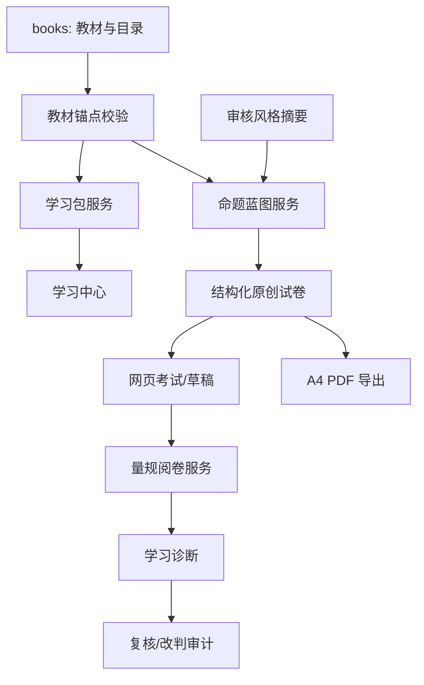

# 教材驱动学习与测评：技术方案（Gate 4）

状态：已确认

## 1. 背景

当前 `assessment.ts` 的题目只有 `choice|fill|essay`、题干、答案和解析。`classroom.ts` 对填空题用字符串相等/包含关系，对解答题请求模型输出 `isCorrect` 布尔值；`quiz_results` 只保存二元题目结果。因此当前实现无法支持分值、评分点、过程分、复核理由和正式卷面。

## 2. 目标

在保持旧测验兼容的前提下，引入教材锚点、资源、命题蓝图、结构化试卷、作答和评分量规模型，并提供可审计的过程性阅卷与 A4 PDF 导出。

## 3. 方案

### 3.1 架构与数据流

### 3.2 数据模型

| 表/实体 | 核心字段 | 说明 |
| --- | --- | --- |
| `learning_packages` | `id, ownerId, bookId, chapterIdsJson, kind, contentJson, status, version` | 听力、视频、复习大纲和数学思维包。 |
| `learning_package_progress` | `ownerId, packageId, completedPlays, submittedAt, updatedAt` | 英语听力的服务端播放进度；最多记录两次完整播放，提交后解锁文本与解析。 |
| `external_resources` | `id, title, subject, grade, knowledgeTagsJson, url, sourceName, durationSeconds, ageLabel, reviewedAt, status, linkHealthStatus, lastHealthCheckedAt` | 仅返回 `reviewedAt` 非空且 `linkHealthStatus=healthy` 的审核公开外链；不保存视频文件。 |
| `style_profiles` | `id, ownerId?, sourceType, sourceUrl, capturedAt, scopeJson, summaryJson, reviewStatus` | 只存风格摘要和审计元数据。 |
| `assessment_blueprints` | `id, ownerId, bookId, chapterIdsJson, examType, difficulty, sectionsJson, styleProfileId?` | 可审查的题型、分值、覆盖与难度契约。 |
| `assessment_papers` | `id, blueprintId, ownerId, schemaVersion, contentJson, totalScore, status` | 原创结构化试卷，版本化不可变。 |
| `paper_attempts` | `id, paperId, ownerId, answersJson, status, diagnosticScore, submittedAt` | 试卷作答与进度。 |
| `attempt_item_results` | `attemptId, questionId, score, maxScore, rubricJson, evidenceJson, confidence, verdict` | 每题评分点、证据与模型置信度。 |
| `review_events` | `id, attemptId, questionId, actorType, action, reason, beforeJson, afterJson, createdAt` | 复核/改判全量审计。 |
| `export_jobs` | `id, paperId, variant, status, filePath, error` | `paper|answer` 两份 PDF 的导出任务。 |

新增表通过 `databaseService.ts` 迁移创建；旧 `classroom_items` 和 `quiz_results` 不改写。教材锚点可来自当前学生的历史资料或 `ownerId=shared` 的家庭共享资料；新上传教材默认写入 `shared`。学习包、试卷、作答等学生产物仍保存当前学生的 `ownerId`。服务端只校验该字段格式和业务关联，不把它当作可信身份或授权凭据。

### 3.3 运行边界

首期不新增认证、会话、家庭共享或静态文件下载授权。`ownerId` 是单设备本地模式下的资料选择上下文，而不是安全边界；API 不得声称能够阻止伪造 `ownerId` 的跨学生访问。新学习路由仅可在受信任的单设备环境启用。未来进入公网或多账户环境前，必须新增身份上下文、资源授权和受控下载方案，并重新启用跨学生越权验收。

### 3.4 API 契约

| 方法 | 路径 | 功能 |
| --- | --- | --- |
| `POST` | `/api/learning-packages` | 创建听力/视频/复习包，返回任务或结果。 |
| `GET` | `/api/learning-packages/:id` | 读取包与生成状态。 |
| `POST` | `/api/learning-packages/:id/playback` | 读取或记录一次完整播放；`event=completed` 达到两次后拒绝继续记录。 |
| `POST` | `/api/assessment-blueprints` | 校验教材范围、难度与风格，生成蓝图。 |
| `POST` | `/api/assessment-papers` | 根据蓝图生成不可变原创试卷。 |
| `GET` | `/api/assessment-papers/:id` | 读取网页/打印渲染数据。 |
| `POST/PATCH` | `/api/paper-attempts`、`/:id` | 创建、保存草稿、提交作答。 |
| `GET` | `/api/paper-attempts/:id` | 读取批改/诊断状态。 |
| `POST` | `/api/paper-attempts/:id/reviews` | 提交复核或改判，写审计事件。 |
| `POST` | `/api/assessment-papers/:id/exports` | 创建 `paper` 与 `answer` PDF 导出任务。 |
| `GET` | `/api/exports/:id` | 读取导出状态或下载文件。 |

`POST /api/learning-packages` 固定接收 `{ ownerId, bookId, chapterIds, kind }`。`kind` 为
`english-listening`、`english-video`、`math-thinking`、`science-video` 或 `review-outline`；服务端从家庭共享或
当前本地资料上下文的教材读取学科、年级、目录和章节正文，不接受客户端提供的正文或资源 URL。
`GET /api/learning-packages/:id?ownerId=...` 只按本地资料上下文读取已创建包。

英语包返回原创标识、脚本、题目、答案、评分点和既有 `/api/tts` 的调用引用；该引用不改变 TTS
接口，也不代表教材原声。视频包仅返回满足 `status=approved`、`reviewedAt IS NOT NULL`、
`linkHealthStatus=healthy` 且具备标题、来源、时长、适龄标签的资源。该筛选是单设备资料模式
的数据行为，不是服务端授权声明。

### 3.5 量规阅卷算法

1. 出题时每个主观题同时生成 `rubric[]`：评分点 ID、要求、分值、可接受等价表达、过程/结果属性和反例。
2. 客观题执行统一规范化：全半角、大小写、空白、数学符号、备选答案集合；任何模糊题转人工复核，不用“包含关系”判满分。
3. 主观题把“题目、量规、学生作答”交给低温模型，要求逐评分点返回 `earnedScore`、学生证据原文、理由和 `confidence`，并在服务端验证评分点完整、分数范围和总分。
4. 过程点可在结果错误时得分；结果点可在过程缺失时按量规给分；同义表述只要满足评分点不得扣分。
5. `confidence < 0.75`、模型结果结构不合法或评分点证据为空时标记“建议复核”，不自动归入已掌握。
6. 复核或改判创建新的审计事件，重算诊断分但不覆盖原模型结果。

### 3.6 PDF 技术选型

- 后端使用 `pdfkit + svg-to-pdfkit` 生成 A4，使用 SIL OFL 1.1 的 Noto Sans CJK SC 字体文件并随镜像发布；数学公式由 MathJax 输出 SVG 后嵌入。
- 试卷和答案卷由同一 `assessment_papers.contentJson` 渲染，导出任务异步保存到现有持久化数据目录。
- PDF 页眉显示“原创试卷/答案卷、教材范围、版本、生成日期”；不得显示风格样本原文或受保护题目。

### 3.7 现有功能保护与验证面

| 保持不变 | 允许变化 | 验证 |
| --- | --- | --- |
| 旧 `/api/generate-assessment` 输入输出、三档难度、历史课堂测验读取。 | 新试卷走独立 API/表。 | 现有 backend 测试 + 手工创建旧章节测验。 |
| 旧错题、课件、TTS 和本地资料选择。 | 新学习中心读取当前选择的教材数据。 | 前端切换 `ownerId` 后不展示另一资料上下文、旧深链回归。 |
| `quiz_results` 历史成绩可读。 | 新诊断采用分值而非题数百分比。 | 打开历史列表与新诊断各一条。 |

## 4. 风险

PDF 中文字体文件会增大镜像，必须在构建时校验许可、文件存在和输出可读；导出失败不能阻塞网页考试。模型评分是诊断工具，量规降低误判但不能替代人工复核。

## 5. 回滚

数据库迁移只新增表；新 API、PDF 导出和评分服务均以开关发布。回滚后保留记录，可在恢复版本继续读取；不删除导出文件和审计数据。

## 6. FAQ

### 为什么不直接增强 `quiz_results.resultsJson`？

历史结构只有二元正确性且缺少分值、量规和版本。直接塞入新字段会把旧测验兼容与正式试卷生命周期耦合，迁移风险高于新增独立模型。
