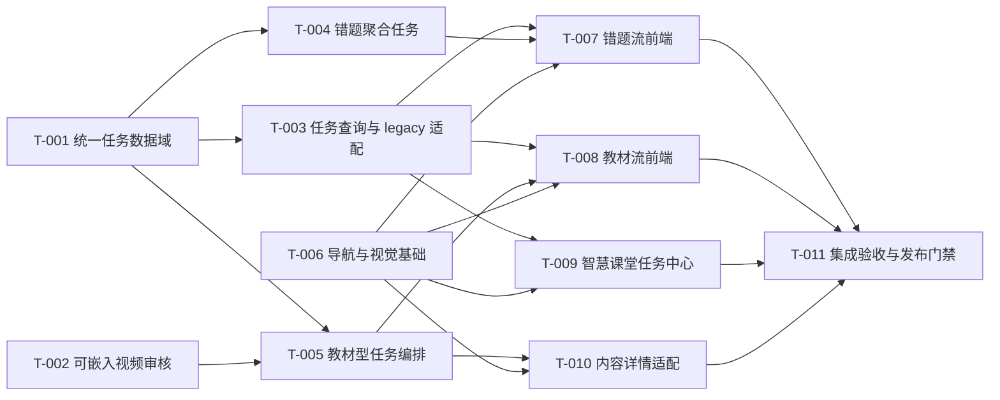

# 学习小助手重构：实施任务分解（Gate 5）

状态：已确认（Gate 5）

上游：BR-001 至 BR-020、US-001 至 US-010、AC-001 至 AC-016，以及 Gate 3、Gate 4 文档。

## 1. 背景

本计划把“独立学习小助手、统一智慧课堂任务中心、错题与教材双流、站内嵌入公开视频”拆成可单独评审和回滚的垂直任务。严格约束业务结果、接口、边界和验收；允许实施者在既有 TypeScript、React、Express、SQLite、Tailwind 和 Lucide 模式内选择具体组织方式。

## 2. 目标

按依赖顺序交付新体验，保持教材、错题、课件、测验、学习包、试卷、诊断和导出实体的内容与历史不被迁移或覆盖。`ownerId` 用于家庭学生档案选择和记录归属；首期不新增登录、角色或成员授权模型。

## 3. 方案

### 3.1 执行纪律

- 编辑任一函数、类或方法前，实施者必须运行 GitNexus `impact(..., direction: upstream)`；HIGH/CRITICAL 风险须先报告。
- 任务只可修改其 `Scope` 列出的模块。若发现需求、PRD、UI 状态、验收、技术契约或任务边界不一致，停止代码修改并按 1-7 偏差分类回到最早受影响文档。
- 每项任务至少有一条关键路径和一条异常路径验证。用户可见任务必须在 1440px、768px、390px 截图并完成键盘检查。
- 提交前必须运行 GitNexus `detect_changes()`；不清理或提交当前工作树中无关的用户改动。

### 3.2 依赖图

### T-001 统一学习任务数据域

**Outcome**

系统可持久化一次学习活动的不可变任务头、原实体链接和状态事件；同一次网络重试不会重复创建任务，再次生成会创建新任务。

**Inputs**

- [业务需求](../requirements/2026-07-28-learning-assistant-business-requirements.md)：BR-014、BR-015、BR-017、BR-018。
- [技术设计](../architecture/2026-07-28-learning-assistant-technical-design.md)：3.2、3.3、3.5 `TaskSummary`。
- [验收](../design/2026-07-28-learning-assistant-page-states-and-acceptance.md)：AC-011、AC-012、AC-014。

**Scope**

- `backend/src/services/learningDomain.ts`、`databaseService.ts` 的追加式 SQLite 迁移。
- 新任务领域 service/DAO、DTO、状态机、幂等与事件记录的后端模块及其单元测试。
- 仅为新任务域所需的 feature flag、日志和指标接线。

**Non-goals**

- 不创建助手页面、课堂列表或内容生成器。
- 不复制、迁移、更新或删除 `classroom_items`、`learning_packages`、`assessment_papers`、作答或诊断。
- 不增加登录、角色、家庭成员授权或跨家庭共享。

**Acceptance**

- 空数据库与含历史记录数据库均能重复升级，只新增表、索引和兼容字段。
- 同一家庭学生档案与 `requestKey` 连续请求返回同一任务；新的 key 得到新任务，既有 ready 任务不变。
- 任务终态和实体链接在同一事务可见；失败任务没有伪实体链接且保留可重试原因。
- `TaskSummary` 符合 Gate 4 定义，列表摘要不包含教材正文、题目、答案或模型输出。

**Freedom**

- 可选择 DAO、repository 或直接 SQL、内部枚举与测试夹具组织。
- 不得改变任务状态、`requestKey` 幂等语义、链接而非复制原则或追加迁移策略。

**Dependencies**

- 无。

### T-002 可嵌入视频审核与资源契约

**Outcome**

系统只将公开、审核、健康、适龄且允许嵌入的第三方视频暴露给教材章节学习；不合格资源不会产生课堂任务。

**Inputs**

- BR-007、BR-008、BR-018。
- Gate 4：3.2 `external_resources`、3.7 视频审核边界。
- AC-006 与视频样例数据。

**Scope**

- `external_resources` 的附加字段、资源审核/健康/嵌入状态校验 service、资源查询 DTO 和后端测试。
- 仅新视频资源查询所需的路由或 service 扩展。

**Non-goals**

- 不搜索、下载、代理、转码、托管第三方视频。
- 不建立学生可见的资源审核后台。
- 不修改听力 TTS 或数学思维内容生成。

**Acceptance**

- 缺少 `reviewedAt`、健康状态、适龄标签、嵌入许可或合格 `embedUrl` 的资源不会出现在可选结果中。
- 合格资源仅返回 ID、标题、时长、适龄标签和审核确认的嵌入 URL。
- 被标记 blocked 或健康检查失败的既有视频任务可显示资源不可用，但不会被替换为未审核资源。

**Freedom**

- 可决定内部审核 worker、HTTP 超时和 allowlist 的实现方式。
- 不得让浏览器推导嵌入 URL，不得扩大为第三方视频搜索或传输服务。

**Dependencies**

- 无；可与 T-001 并行实现。

### T-003 智慧课堂任务查询与 legacy 适配 API

**Outcome**

智慧课堂可通过一个后端契约读取新任务与已有课件、测验、学习包、试卷的只读摘要，并解析到原实体详情而不回填历史任务。

**Inputs**

- BR-002、BR-014、BR-015、BR-020。
- Gate 4：3.1、3.5 任务读取 API、3.6 路由下线、3.8 legacy 策略。
- AC-002、AC-011、AC-012、AC-015。

**Scope**

- 新 `learning-tasks` 查询/详情/重试路由和服务。
- 只读 legacy 适配器，读取现有 `classroom_items`、学习包、试卷及其结果摘要。
- API 集成测试、游标分页、原实体丢失和失败任务测试。

**Non-goals**

- 不创建任何前端页面或修改原实体详情 API。
- 不将 legacy 数据写入 `learning_tasks`，不回填章节、错题来源或生成意图。
- 不恢复 `#learn/*` URL。

**Acceptance**

- 新任务和 legacy 项目以稳定 `TaskSummary` 返回，按更新时间倒序且可按状态、学科、类型、教材过滤。
- `legacy:<entityType>:<entityId>` 可只读解析；原实体缺失返回 `410 task_target_missing`。
- 失败任务只在没有 ready 链接时允许重试；列表、详情和异常响应符合 Gate 4 错误码契约。

**Freedom**

- 可选择 legacy 查询适配器和游标编码方式。
- 不得从前端拼表、复制历史实体或改变原详情/导出/诊断接口语义。

**Dependencies**

- T-001。

### T-004 多错题讲解与测验任务服务

**Outcome**

学生一次选择 1-10 道同学科错题后，系统创建一个独立任务，产出一份聚合讲解和一份只覆盖所选知识点的原创测验，并在任务中链接二者。

**Inputs**

- BR-003、BR-004、BR-005、BR-013、BR-014、BR-015。
- Gate 4：3.3、3.4 `wrong_review`。
- AC-003、AC-004、AC-010、AC-011、AC-012。

**Scope**

- 错题候选聚合读取 API、自动学科归类、来源校验和多题任务适配 service。
- `wrong_problem_quiz_links` 的兼容写入、`classroom_items` 原实体创建和任务链接事务。
- 相关模型调用适配、后端集成测试与错误处理。

**Non-goals**

- 不修改错题本原始识别结果或强制把错题映射到教材章节。
- 不按每题创建多个学习任务，不修改现有单题历史内容。
- 不实现前端的选题交互或课堂列表。

**Acceptance**

- 只接受当前家庭学生档案下、同一选定学科的 1-10 个有效题目引用；误识别题可由调用方排除而不改源数据。
- 成功后恰有一个 `wrong_review` 任务、一个讲解链接和一个测验链接；每个来源题保持兼容链接记录。
- 原创测验知识点范围只来源于本次引用；模型或单题失败时任务进入可解释失败状态且不产生不完整 ready 任务。

**Freedom**

- 可决定知识点合并、提示词和讲解/测验内部排版。
- 不得扩大题源、保存真题全文、覆盖旧内容或改变多题聚合为多任务的业务语义。

**Dependencies**

- T-001。

### T-005 教材章节任务编排服务

**Outcome**

系统基于当前家庭学生档案可见的教材和具体章节，按学科能力创建课件、随堂测验、听力、视频、思维训练和模拟考试任务；每个产物自动链接到智慧课堂任务。

**Inputs**

- BR-006 至 BR-013、BR-018 至 BR-020。
- Gate 4：3.3、3.4、3.5 助手章节能力与任务写入 API。
- AC-005 至 AC-010、AC-012、AC-015。

**Scope**

- 助手概览、章节能力、教材流任务创建 API 与服务编排。
- 对既有 courseware、quiz、learning package、assessment blueprint/paper、export/diagnosis 服务的受控适配与任务链接。
- 数学奥数资料年级可用性检查、英语听力两次播放兼容、视频资源选择校验与后端测试。

**Non-goals**

- 不重写已有课件、试卷、听力、PDF 或批改领域实现。
- 不生成平台教材、未审核视频或外部题目全文。
- 不实现导航、助手表单或课堂列表 UI。

**Acceptance**

- 课件和随堂测验在没有有效教材章节时拒绝创建；英语、数学、语文、科学动作严格匹配能力矩阵。
- 英语听力仍以章节正文生成原创内容并保留两次完整播放限制；视频只接受 T-002 返回的合格资源。
- 数学奥数模拟考试仅在上传资料的标注年级与当前学生/教材范围匹配时可用；常规教材模拟考试不受该条件阻断。
- 成功生成的每种产物均创建独立任务并链接原实体；试卷保持旧卷不可变、网页作答、A4 PDF 和复核契约。

**Freedom**

- 可选择服务分派、同步/异步队列、动作能力计算和内部 DTO 映射。
- 不得绕过教材章节锚点、视频审核、原创约束、试卷版本和原实体 API 兼容性。

**Dependencies**

- T-001、T-002。

### T-006 全局导航、路由下线与视觉基础

**Outcome**

应用在桌面和移动端固定显示“我的看板、学习资料、学习小助手、智慧课堂”；学习中心入口、标题和旧 `#learn/*` 内容路由被移除，整体外壳采用 Gate 3 的学习工作台视觉基础。

**Inputs**

- BR-001、BR-002。
- Gate 3：前端设计 3.1、UI/UX 3.1-3.3、响应式契约。
- AC-001、AC-002、AC-016。

**Scope**

- `App.tsx` Hash 解析和顶级页面装配、`Layout.tsx` 桌面/移动导航。
- 学习资料移除 workshop 子页后的路由与入口；新的页面下线状态组件。
- 全局主题令牌、字体接线和与本次页面有关的共享基础组件样式。
- 路由、键盘、三视口浏览器测试。

**Non-goals**

- 不实现错题/教材选择、任务读取或任何生成 API。
- 不删除原有课件、测验、学习包、试卷和诊断实体。
- 不把 `#learn/*` 重定向或解析为新页面详情。

**Acceptance**

- 顶级导航顺序精确匹配 AC-001，移动底栏文本不截断；学习资料中没有学习小助手 workshop 标签。
- `#learn/*` 仅显示下线状态和通往 `#assistant`、`#tutor` 的入口，不发出旧内容 API 请求。
- 在 390px、768px、1440px，Noto Sans CJK SC 正常回退、焦点可见、长标题与底栏不遮挡。

**Freedom**

- 可调整组件名称、局部 CSS 结构和主题变量组织。
- 不得改变已确认导航顺序、下线路由语义、视觉令牌的语义用途或引入新路由框架/全局状态库。

**Dependencies**

- 无；可与后端任务并行。

### T-007 学习小助手错题流前端

**Outcome**

学生可在独立学习小助手中查看自动学科归类的错题与课堂错题，切换学科、排除误识别项、选择多题并创建错题讲解与测验任务。

**Inputs**

- BR-003 至 BR-005、BR-014、BR-015、BR-017。
- Gate 3：学习小助手错题流、UI/UX 3.4 与 3.6、页面状态。
- T-003、T-004 API；AC-003、AC-004、AC-011、AC-012、AC-016。

**Scope**

- `#assistant/wrong` 页面、错题来源切换、学科筛选、可访问选题列表、选择摘要和生成行动条。
- 新助手 API 客户端、生成状态、字段校验、失败重试与进入课堂命令。
- 此流的浏览器、键盘和响应式测试。

**Non-goals**

- 不修改错题源数据、教材目录或课堂任务列表。
- 不在浏览器生成讲解、知识点或测验。
- 不实现教材流、视频嵌入或试卷作答页面。

**Acceptance**

- 有错题时按自动学科显示计数；切换或排除只改变本次选择，不修改源记录。
- 未选题时生成按钮禁用且说明原因；选择多题后生成一个任务，并可从成功反馈进入智慧课堂。
- 生成中、失败、无错题和来源读取失败均保留学生已做选择并符合页面状态文档。
- 三视口和键盘验收通过。

**Freedom**

- 可选择列表虚拟化、局部 Hook、选择摘要表现和细小交互。
- 不得改变“错题不必绑定教材章节”“一任务聚合多题”或 Gate 3 状态、无障碍和视觉契约。

**Dependencies**

- T-003、T-004、T-006。

### T-008 学习小助手教材章节流前端

**Outcome**

学生可选择可见教材和具体章节，快速看到与学科严格匹配的生成动作，并创建课件、随堂测验、听力、视频、思维训练或模拟考试任务。

**Inputs**

- BR-006 至 BR-013、BR-018 至 BR-020。
- Gate 3：教材流、能力矩阵、UI/UX 3.4、页面状态。
- T-003、T-005 API；AC-005 至 AC-010、AC-012、AC-015、AC-016。

**Scope**

- `#assistant/textbook`、教材/章节选择、目录抽屉、能力动作网格、模拟考试配置入口和生成行动条。
- 视频资源选择/不可用提示、奥数资料条件提示、API 客户端及此流浏览器测试。

**Non-goals**

- 不在前端解析教材正文、不搜索视频、不生成题目或 PDF。
- 不修改错题流选择状态或课堂任务列表。
- 不显示后端已判定不可用的动作作为可点击命令。

**Acceptance**

- 课件/随堂测验没有有效章节时不可操作；章节确认后动作严格匹配学科矩阵。
- 无嵌入视频、年级不匹配奥数资料、教材元数据不全均显示原因且不创建任务。
- 生成成功显示任务摘要和进入智慧课堂命令；模拟考试保留范围、类型、难度、网页作答和 A4 下载链路。
- 三视口、键盘和长教材/章节文本检查通过。

**Freedom**

- 可选择目录浏览、学科动作布局、摘要面板和模拟考试跳转的内部实现。
- 不得改变教材章节必填、视频审核、奥数条件、两次播放和考试版本/诊断契约。

**Dependencies**

- T-003、T-005、T-006。

### T-009 智慧课堂统一任务中心前端

**Outcome**

智慧课堂成为学生发现、继续和回看新任务与 legacy 内容的唯一聚合入口，按状态、学科、类型和教材/章节筛选，并安全解析到原实体详情。

**Inputs**

- BR-014、BR-015、BR-016、BR-020。
- Gate 3：智慧课堂页面、UI/UX 3.5、页面状态。
- T-003 API；AC-011 至 AC-016。

**Scope**

- `#tutor` 任务快速区、筛选、分页任务列表和 `#tutor/task/:taskId` 解析页。
- AIClassroom 相关列表/历史的受控改造或独立 task hub 组件、任务 API 客户端、空/失败/资源不可用状态。
- 课堂任务的浏览器、键盘和响应式测试。

**Non-goals**

- 不复制内容、重算成绩或修改试卷复核数据。
- 不实现助手的生成表单或修改原课件/试卷正文。
- 不自动把旧 `#learn/*` 跳转到课堂任务。

**Acceptance**

- 可在一个列表发现新任务和只读 legacy 项，按约定筛选并继续到正确原实体。
- 每行只显示一个符合状态的主操作；失败、资源不可用和原实体缺失有可理解原因与返回课堂动作。
- 删除/重新生成/复核不占用主操作区；长标题、章节和状态在三视口不重叠。

**Freedom**

- 可选择分页、筛选 state、列表分组与组件拆分。
- 不得在前端拼接原表、展示敏感正文摘要或改变任务解析、legacy、状态和视觉契约。

**Dependencies**

- T-003、T-006。

### T-010 学习内容详情与站内视频适配

**Outcome**

从智慧课堂进入后，学生可以继续已有课件、随堂测验、听力、思维训练、试卷和合格视频任务；视频在站内以第三方允许的嵌入方式播放，所有返回文案不再出现学习中心。

**Inputs**

- BR-008、BR-009、BR-014 至 BR-016、BR-019、BR-020。
- Gate 3：任务详情解析、视频与听力状态、UI/UX 交互规则。
- T-002、T-005、T-009；AC-006、AC-007、AC-012、AC-013、AC-015、AC-016。

**Scope**

- 原有学习包、听力、视频、课件/测验详情与试卷入口的任务上下文适配。
- 第三方 iframe 嵌入容器、资源失效状态、可访问标题、加载/失败提示和“返回智慧课堂”导航文案。
- 详情路径的浏览器、键盘、两次播放和安全嵌入验证。

**Non-goals**

- 不下载、代理、托管或转码第三方视频。
- 不修改试卷出题、PDF 渲染、批改算法或原内容数据结构。
- 不恢复任何旧学习中心标题或 `#learn/*` 深链。

**Acceptance**

- 合格视频只使用后端给出的 `embedUrl`，iframe 具备最小必要 sandbox/allow 属性；资源失效显示原因而非空白播放器。
- 英语听力的播放次数、解锁作答和提交行为与 AC-007 一致；课件、测验、试卷和诊断从课堂任务进入后保持原行为。
- 所有返回导航指向智慧课堂或学习小助手，页面中不存在学习中心文字。
- 三视口、键盘、嵌入安全属性和两次播放验证通过。

**Freedom**

- 可决定 iframe 容器、详情适配组件和局部错误边界的内部实现。
- 不得创建视频传输通道、绕过嵌入许可、修改既有作答/诊断数据或破坏原实体详情兼容性。

**Dependencies**

- T-002、T-005、T-006、T-009。

### T-011 集成验收、发布门禁与回滚证据

**Outcome**

系统以四年级教材、错题、视频和奥数资料完成端到端验收，形成可复核的功能、视觉、接口、回滚和已知风险证据后才可发布。

**Inputs**

- 全部 BR、US、AC。
- Gate 3 视觉验收与页面状态、Gate 4 发布/回滚、T-001 至 T-010 证据。

**Scope**

- 端到端/集成/API/浏览器验收脚本、验收样例数据、发布检查清单和回滚记录。
- 任务分解文档状态更新、发布证据文档和必要的可观测性检查。

**Non-goals**

- 不在本任务新增产品功能、数据迁移策略、视觉方向或权限模型。
- 不清理历史实体、任务记录或用户已有的无关工作树改动。

**Acceptance**

- AC-001 至 AC-016 全部有命令、截图、API 断言或人工观察证据；失败项明确标为未通过，不以“基本可用”替代。
- 使用四年级数学完成课件、随堂测验、思维训练、常规/奥数模拟考试和课堂归档验证；英语听力、语文/科学视频均覆盖相应最小路径。
- 三个视口、键盘、嵌入视频、两次播放、任务幂等、旧 URL 下线、原实体回归和错误路径均通过。
- `detect_changes()`、构建、类型检查和相关后端测试通过；发布开关、回滚步骤、剩余风险和家庭协作模式边界写入发布证据。

**Freedom**

- 可选择 Playwright、现有测试框架、API 脚本和证据组织形式。
- 不得通过降低验收标准、删除失败用例、绕过 feature flag 或修改既有需求来换取发布通过。

**Dependencies**

- T-007、T-008、T-009、T-010。

## 4. 风险

- T-001 至 T-005 涉及状态和数据契约；一旦输入、任务状态或原实体链接语义发生变化，必须回到 Gate 4，而不是在前端兼容猜测。
- T-006 会触及全局 Layout 和 Hash 路由，必须按 GitNexus 影响结果控制范围并验证我的看板、学习资料和原智慧课堂的回归。
- 视频 iframe 的可用性依赖第三方嵌入许可；测试环境的成功不能替代生产链接健康检查。

## 5. 回滚

关闭 `LEARNING_TASKS_ENABLED` 并隐藏新助手/任务中心入口可停止新创建，不删除 `learning_tasks`、链接、事件或原实体。旧 `#learn/*` 始终维持下线状态；回滚不恢复学习中心。

## 6. FAQ

### 为什么任务中心在前端任务之后才实施？

任务中心依赖稳定的查询与解析契约，但可与助手前端并行开发。将查询 API 独立为 T-003 后，T-007、T-008、T-009 的接口边界可分别验收，避免 UI 再次直接访问多张内容表。
